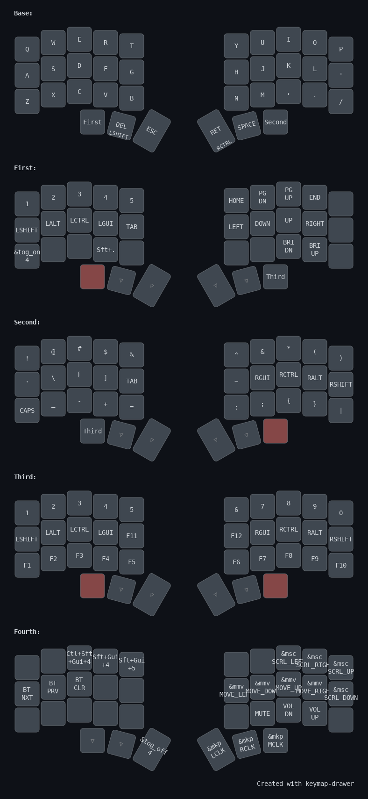

# CORNE v4 from TyperActive with ZMK

TyperActive docs: https://docs.typeractive.xyz/build-guides/corne-wireless/firmware#installing-firmware
Cloned from: https://github.com/typeractivexyz/corne-wireless-5-col-view-zmk-config

Since i like to use vim mappings, the arrow keys on the First layer is the same as HJKL on the Base layer. I find that keeping SHIFT, ALT, CTRL and GUI on the same keys with different layers (also on the left side) makes it extremely convenient. I find that using mod-tap shift works better for me than auto-shift. Having RCTRL mod-tap with RET allows me to hold down that button and invoke CTRL, which is useful in vim.

The first 3 layers can be invoked quite quickly with the thumb.

Recently added a 4th layer for mouse controls and it works quite well for times where i just want to click or scroll down quickly.

One downside is that the mo layers are mapped on the furtherest keys so i need to move my thumb inwards into my palm, which is not that comfortable for long periods, but I've gotten used to this keymap and I don't really want to change it for now :P

